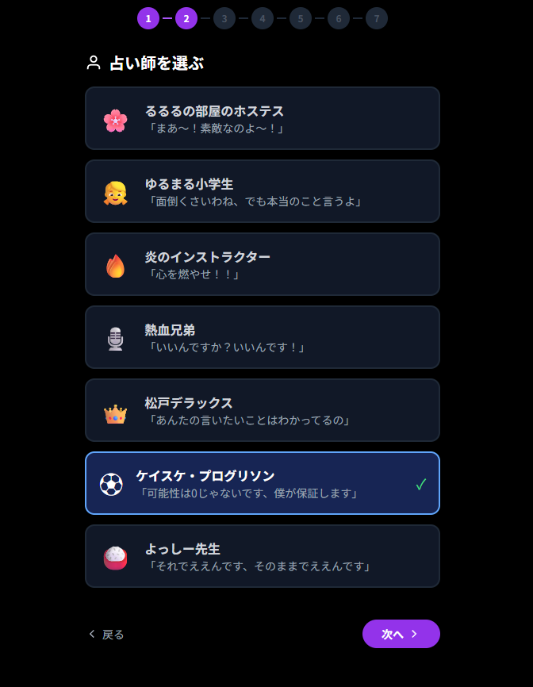
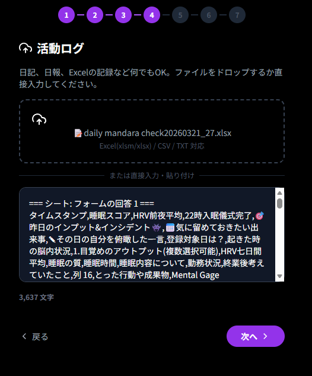
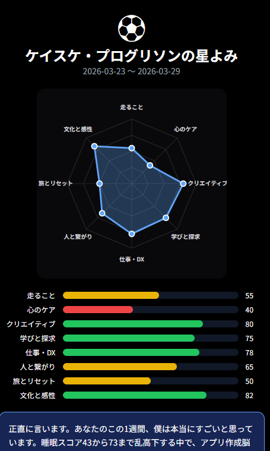

# 🔮 7人の星読みたち (hoshiyomi-seven, 7 Star-Gazers)

**「マンダラチャート（目標）」と「日々の活動ログ」を、7人の個性豊かな占い師たちが照合・分析。**
あなたの歩みを独自の視点で評価し、明日への活力を注入するフィードバック・ツールです。

  
  
▲ ちょっとクセありの7人(組)の占い師から選ぶワクワク感

---

## 🌟 これは何？
ただの目標管理ツールではありません。
「目標（マンダラチャート）」と「現実（活動ログ）」のギャップを、AIが占い師になりきって分析します。

* **HTMLマンダラ対応**: マンダラチャート作成ツールから出力されたHTMLをそのまま解析。
* **7人のキャラクター**: るるるの部屋のホステスから、熱血インストラクター、毒舌デラックスまで。
* **レーダーチャート分析**: 8つのカテゴリごとに活動量を可視化。
* **ラッキーアクティビティ**: 明日すぐできる行動を、キャラが自分の経験談を交えて提案。

  
  
▲ ファイルをドロップするだけの手軽な入力

---

## 🎭 占い結果のイメージ
あなたの活動を多角的に分析し、美しいレーダーチャートと愛のあるメッセージをお届けします。

  
  
▲ 可視化されたスコアと具体的なフィードバック

---

## 🚀 使い方
1. **占い師を選択**: その時の気分に合わせてキャラを選びます。
2. **目標をアップロード**: マンダラチャートのHTMLやテキストを入力。
3. **ログをアップロード**: 日報やExcel、CSVなどの活動記録を入力。
4. **AI分析**: プロンプトをコピーしてAIに投げるか、APIキーを入力して直接実行。
5. **結果確認**: キャラからの愛ある喝（かつ）と励ましを受け取りましょう！

## 🛠️ 技術構成
* **Frontend**: React, Tailwind CSS, Lucide-react
* **Data Processing**: XLSX (Excel解析), DOMParser (HTML解析)
* **AI Engine**: Anthropic Claude API 推奨
